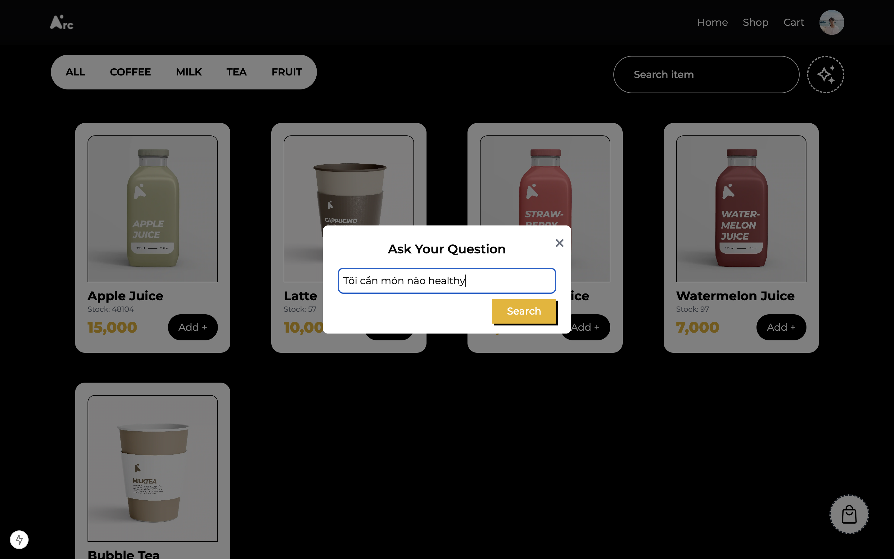

# eCommerce Website - Bottled Water Vending

## Description

This is an eCommerce website built with **Next.js**, providing a seamless and responsive shopping experience. The website includes features such as product display, shopping cart, user authentication, order management, and payment processing.

---

## Preview

### 1. Website UI


### 2. Key Features
#### Product section


#### Shopping Cart


### 3. Gemini Chatbot



---

### Features

- **Product Pages:** Display products with details, images, and pricing.
- **Shopping Cart:** Add, remove, and update products in the cart.
- **User Authentication:** Login and signup functionality (JWT or OAuth integration).
- **Order Management:** Users can review their order, enter shipping information, and process payment.
- **Responsive Design:** Optimized for desktop, tablet, and mobile devices.

---

## Table of Contents

- [Getting Started](#getting-started)
- [Prerequisites](#prerequisites)
- [Installation](#installation)
- [Configuration](#configuration)
- [Run the Project](#run-the-project)
- [Usage](#usage)
- [Tech Stack](#tech-stack)
- [License](#license)

---

## Getting Started

Follow these steps to set up the project locally.

---

## Prerequisites

Ensure you have the following installed on your system:

- **Node.js:** Version 16 or higher.
- **npm** or **yarn** for package management.
- **Redis:** For session management (via `ioredis`).
   - To install locally:
     - **Linux:** `sudo apt install redis`
     - **MacOS:** `brew install redis`
     - **Windows:** Use Docker or WSL for Redis.

---

## Installation

1. Clone the repository to your local machine:

   ```bash
   git clone https://github.com/TuananhDo0308/arccoffee.git
   cd arccoffee.git
   ```

2. Install the dependencies:

   ```bash
   npm install
   # or
   yarn install
   ```

---

## Configuration

1. Create an `.env.local` file in the root directory to store your environment variables. Example configuration:

   ```env
   AUTH_SECRET=your_auth_secret
   NEXTAUTH_URL=http://localhost:3000

   GOOGLE_CLIENT_ID=your_google_client_id
   GOOGLE_CLIENT_SECRET=your_google_client_secret

   GEMINI_API_KEY=your_gemini_api_key

   SMTP_HOST=smtp.example.com
   SMTP_PORT=587
   SMTP_USER=example@example.com
   SMTP_PASS=your_smtp_password

   REDIS_URL=redis://localhost:6379
   ```

2. Verify that Redis is running on your system:

   - Start Redis:
     ```bash
     redis-server
     ```
   - Test the connection:
     ```bash
     redis-cli ping
     ```

---

## Run the Project

### Development

1. Start the development server:
   ```bash
   npm run dev
   # or
   yarn dev
   ```

2. Open the application in your browser at `http://localhost:3000`.

### Production

1. Build the project:
   ```bash
   npm run build
   # or
   yarn build
   ```

2. Start the production server:
   ```bash
   npm run start
   # or
   yarn start
   ```

---

## Usage

Once the project is running, users can:

- Browse the catalog of bottled water products.
- View product details, including images, descriptions, and pricing.
- Add items to their shopping cart.
- Register or log in to manage their orders and account.
- Proceed to checkout to complete orders with secure payment processing.

---

## Tech Stack

The project uses the following technologies:

The project uses the following technologies:

- **Next.js:** React framework for building performant web applications.
- **NextAuth.js:** Authentication and session management.
- **Redux Toolkit:** State management for predictable application state.
- **Framer Motion:** Animation library for smooth transitions and effects.
- **Tailwind CSS:** Utility-first CSS framework for responsive design.
- **Redis:** Session management and caching.
- **Axios:** For making HTTP requests.


---

## License

This project is licensed under the [MIT License](LICENSE).

---

This eCommerce website for bottled water vending is a perfect solution for businesses seeking a modern, scalable, and responsive platform. Happy coding! 💧
